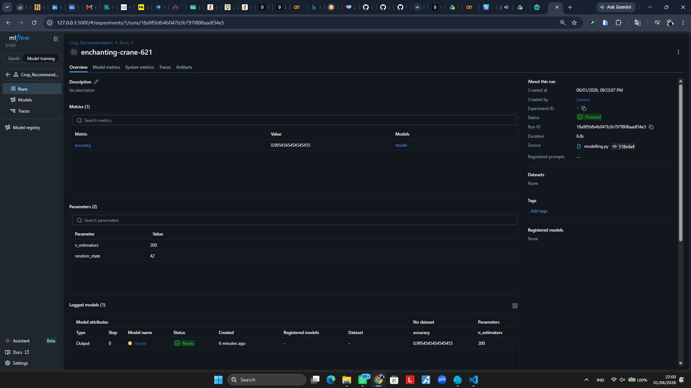
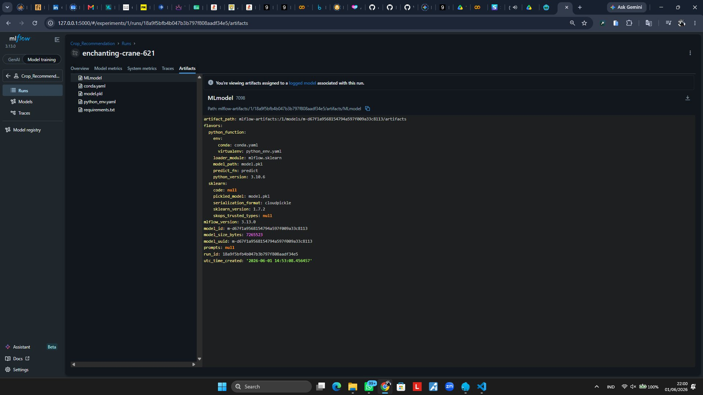

# Crop Recommendation ML

## Deskripsi Project

Project Machine Learning untuk merekomendasikan jenis tanaman berdasarkan kondisi tanah dan lingkungan.

Model memanfaatkan dataset Crop Recommendation dan menggunakan algoritma Random Forest Classifier untuk melakukan klasifikasi tanaman yang paling sesuai.

## Dataset

Dataset berisi beberapa fitur:

- Nitrogen (N)
- Phosphorus (P)
- Potassium (K)
- Temperature
- Humidity
- pH
- Rainfall

Target:

- Label (Jenis Tanaman)

## Struktur Project

### Eksperimen_SML_Masrukhin
Berisi proses eksplorasi data dan preprocessing dataset.

### Membangun_model
Berisi proses training model Random Forest dan penyimpanan model.

File utama:

- modelling.py
- crop_model.pkl

### Workflow-CI
Berisi implementasi Continuous Integration menggunakan GitHub Actions.

File utama:

- MLProject
- conda.yaml
- modelling.py
- requirements.txt

## Algoritma

Model yang digunakan:

- Random Forest Classifier

Parameter:

- n_estimators = 200
- random_state = 42

## Hasil Evaluasi

Accuracy:

```
0.9954
```

## MLflow Tracking

Project menggunakan MLflow untuk melakukan:

- Tracking parameter
- Tracking metric
- Logging model artifact

### Dashboard MLflow



### Artifact MLflow




## CI/CD

Workflow GitHub Actions akan berjalan otomatis setiap push ke branch main.

Tahapan workflow:

1. Checkout Repository
2. Setup Python
3. Install Dependencies
4. Training Model
5. Upload Artifact Model

## Cara Menjalankan

Install dependency:

```bash
pip install -r requirements.txt
```

Training model:

```bash
python modelling.py
```

Menjalankan MLflow:

```bash
mlflow ui
```

Akses dashboard:

```text
http://127.0.0.1:5000
```

## Author

Muhammad Masrukhin Ferdian | Politeknik Negeri Jember